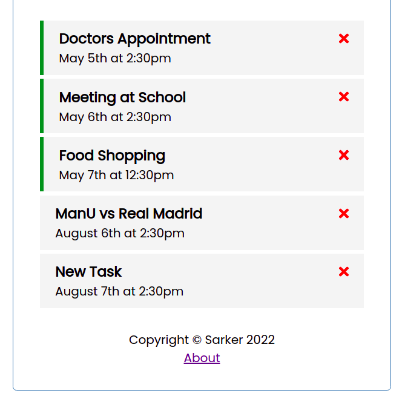

# Task-Tracker
Simple SPA where you can use CRUD operations to maintain your tasks. Mock backend JSON-Server is used to get the data.

## Usage

### Install dependencies

```
npm install
```

### Run Angular server (http://localhost:4200)

```
ng serve
```

### Run the JSON server (http://localhost:5000)

```
npm run server
```

### Screenshots
```
1. Home Page
```


```
2. Add task
```


```
3. Task List
```
